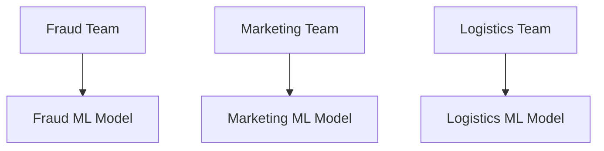
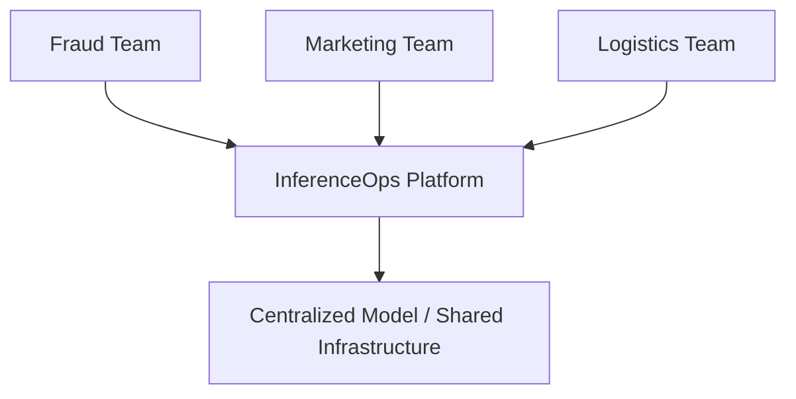
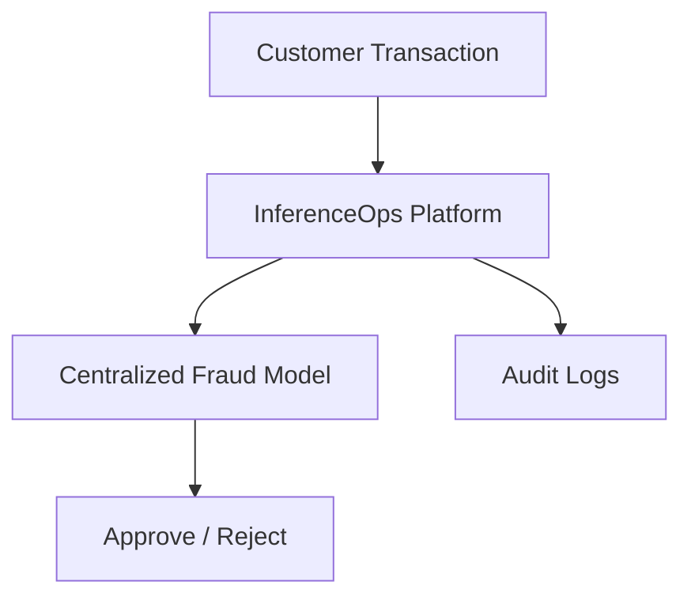
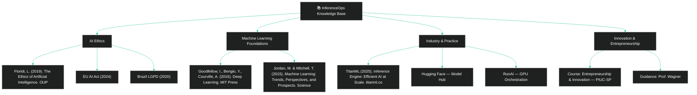

<br>

##   <p align="center"> [Humanistic]() Data Science and Artificial Intelligence (CDIA): [**Ethical Entrepreneurships**]()


<br><br>

#### <p align="center"> [](https://github.com/sponsors/Mindful-AI-Assistants)


<br><br>


https://github.com/user-attachments/assets/e2771de0-ca57-4750-b708-74f0dceaade3

###### 🎶  ***[Vivaldi - The Four Seasons 'Winter']()  ⚡️ Art by Fabi***  


<!--Confidentiality Statement-->

<br><br>

<br><br>


> [!IMPORTANT]
>
> ⚠️ Heads Up 
>
> * Projects and deliverables may be made [publicly available]() whenever possible.
>
> * The course prioritizes [**hands-on practice**]() with real data in consulting scenarios.
>
> *  All activities comply with the [**academic and ethical guidelines of PUC-SP**]().
>
> * [**Confidential information**]() from this repository remains private in [private repositories]().
>
> * [**Confidential information**]() from this repository remains private in [private repositories]().
>
>


#  

<br><br><br>

<!--End-->


> [!TIP]
> 
>  Startup Links: Brazil & Beyond 🌎
> 
> - [Startups Digital Magazine](https://startups.com.br/)
> 
> - [Startups - Fintech](https://startups.com.br/negocios/fintech/)
> 
> - [Innovation](https://startups.com.br/negocios/inovacao/)
> 
> - [Open Innovation](https://startups.com.br/negocios/inovacao-aberta/)
> 
> - [GovTech](https://startups.com.br/negocios/govtechs/)
> 
> - [Healthtechs](https://startups.com.br/negocios/healthtechs/)
>
> - [Foodtech](https://startups.com.br/negocios/foodtech/)
>
> - [HRTech](https://startups.com.br/negocios/hrtech/)
>
> - [IDTech](https://startups.com.br/negocios/idtech/)
>
> - [Insurtech](https://startups.com.br/negocios/insurtech/)
>
> - [Proptechs](https://startups.com.br/negocios/proptechs/)
>
> - [Outside Brazil](https://startups.com.br/la-fora/)
>
> - [Angel Investment](https://startups.com.br/negocios/investimento-anjo/)
>
> - [Founder Launcher](https://www.youtube.com/@ycombinator/featured) 
>
> - [Business Plan 1](https://github.com/Mindful-AI-Assistants/Humanistic-AI-DataScience-PucSP-Ethical-Entrepreneurship/tree/e8d17fc7866f1941dd609e1b9ecb1798dfa7a863/Business_Plan_1)
>
> - [Business Plan 2](https://github.com/Mindful-AI-Assistants/Humanistic-AI-DataScience-PucSP-Ethical-Entrepreneurship/tree/e8d17fc7866f1941dd609e1b9ecb1798dfa7a863/Business_Plan_2)
>


<br><br><br>


##  <p align="center"> [**Introduction for the Repository**]()

<br>

This repository gathers materials and resources on the topic [Humanistic Data Science and Artificial Intelligence (CDIA)]() – Entrepreneurship, Soft Skills, and Business Plans – PUC-SP, led by Professor [Wagner Tufano]() and [Myrt Cruz]()

Its purpose is to provide supporting content, links, notes, and activities focused on developing essential behavioral skills—such as leadership, communication, creativity, critical thinking, and problem-solving—and practical entrepreneurship knowledge, including business plan development, for those who wish to pursue entrepreneurship in the context of CDIA (Data Science, Artificial Intelligence, and related areas).  

This space is open for collaboration: explore, share, and enhance your skills alongside the PUC-SP academic community!


<br><br>


# I -  [**Entrepreneurship**](): 
### Taking Risks, Identifying Opportunities, and [Creating Profitable]() 


<br>

### ⚡️ [Click here](https://github.com/Mindful-AI-Assistants/CDIA-Entrepreneurship-Soft-Skills-PUC-SP/blob/0e4d08c63c468bcbcd6fe5139bd3a6b68122a06c/class_1-Entrepreneurship/Entrepreneurship.pdf) to launch the deck!

<br>


Entrepreneurship is the process of creating and growing new businesses by transforming innovative ideas into profitable ventures. A key characteristic of successful entrepreneurs is their willingness to assume risk. Taking risks involves stepping into uncertainty, making decisions without guaranteed outcomes, and being ready to face challenges and setbacks. However, it is this calculated risk-taking that often leads to breakthrough innovations and significant rewards.

Identifying opportunities is another fundamental aspect of entrepreneurship. Entrepreneurs have a keen eye for spotting gaps in the market, emerging trends, and unmet needs. They analyze their environment carefully to discover potential business ideas that others may overlook. Once these opportunities are recognized, entrepreneurs act decisively to acquire the necessary resources, develop products or services, and accelerate growth.

Transformation is central to entrepreneurship. Entrepreneurs do not merely see an opportunity; they put in the work to transform that idea into a viable, scalable, and profitable business. This requires creativity, strategic planning, efficient execution, and adaptability.

Venture capital plays a critical role in enabling entrepreneurs to scale their businesses. Venture capitalists provide essential funding, mentorship, and networks, helping startups grow rapidly and navigate competitive markets. By combining risk-taking, opportunity identification, and the support of venture capital, entrepreneurs can turn innovative ideas into successful, profitable companies that contribute to economic growth and job creation.


<br>

## 3 [Common Myths About Entrepreneurship]()

<br>

1. [**Entrepreneurs are Born, Not Made**]()  
It is a common myth that entrepreneurs naturally have a "gene" for business or special traits they are born with. In reality, entrepreneurship is a skill that anyone can learn and develop over time. Qualities such as creativity, resilience, willingness to learn from failure, and business acumen can be acquired through experience and education.

<br>

2. [**You Need a Lot of Money to Start a Business**]()  
Many believe that starting a business requires a large amount of initial capital. However, many successful ventures begin with minimal investment, sometimes as a side hustle. There are also models like franchises or online businesses that allow entrepreneurs to start with lower costs and scale up gradually.

<br>

3. [**You Must Have a Brilliant, Innovative Idea to Succeed**]()   
Another misconception is that only completely original and revolutionary ideas lead to success. In fact, many thriving businesses are built by improving existing ideas or executing them more effectively. The key is turning an idea into a viable business and adapting it to meet market needs.


<br><br>


# II  - [Business Plan and Angel Investor]() 

<br>

### ⚡️ [Click here](https://github.com/Mindful-AI-Assistants/CDIA-Entrepreneurship-Soft-Skills-PUC-SP/blob/0e4d08c63c468bcbcd6fe5139bd3a6b68122a06c/class_2-Business%20Plan-Angel%20Investor/Business%20Plan-Angel%20Investor.pdf) to launch the deck!

<br>


The ultimate [*startup hustle guide*]()*. Nail the moves to launch your business and make investors ✍🏻 ask, ["Where do I sign?"]()

Packed with insights from [*Business Plan & Angel Investor*]() (Prof. Wagner Tufano, 2025), this section blends strategy with hustle so you can pitch, scale, and thrive—fast. 💥

<br>


###   💸 [Angel Investors & Venture Capitals]()

Angel investors = your startup’s fairy godparents. They throw some cash your way, plus give you the wisdom and connections to level up. Venture Capitals? They’re the big players with the deep pockets, ready to help you scale like crazy—but they expect serious returns and a seat at the table.

<br>

### [Planning: Your Startup’s GPS]() 

No plan? No glory. Lack of planning is the #1 reason startups bomb. You gotta map out your business, your goals, and your steps. A killer plan means you’re ready to pivot, slide through challenges, and keep on winning.

<br>

### 🎯 [Business Model: What’s Your Game ?]() 

Know your hustle. What exactly are you selling? Who’s your tribe? How are you gonna make money? The biz model’s the blueprint that shows how you create value and keep the lights on.

<br>


## [Business Plan: Your Pitch Deck IRL]()

<br>

Your business plan is like your pitch deck brought to life in words—a detailed but exciting roadmap that tells your startup's story, plans, and potential. Here's the lowdown on each key section:

<br>

| [Section]()                     | [What It Means]()                                      | [Why It Matters]()                                   |
|-----------------------------|---------------------------------------------------|-------------------------------------------------|
| [**Executive Summary**]()        | Your killer opening hook. A sharp summary of the whole plan. | Grabs attention, makes investors want to read more. |
| [**Strategic Analysis**]()       | Your mission & vision—the why and where you're headed. | Shows clear purpose and long-term direction.    |
| [**Business Description**]()     | Who you are, your history, structure, and legal stuff. | Builds credibility and context.                   |
| [**Products/Services**]()        | Detailed look at what you offer, how it’s made, and lifecycle. | Demonstrates innovation and market fit.          |
| [**Organization & Team**]()      | Who's running the show, their skills, and info systems support. | Proves you have the talent and tools to win.     |
| [**Market Analysis**]()          | Market size, customer segmentation, competition. | Shows you’ve done your homework on where you play. |
| [**Industry & Trends**]()        | The wider ecosystem, trends, risks, and opportunities. | Positions your startup against market shifts.   |
| [**Marketing Strategy**]()       | How you'll create demand and steal customers from competitors. | Drives growth and customer acquisition.          |
| [**Financial Plan**]()           | Cash flow, break-even, ROI, IRR, KPIs, projections. | Validates business viability and return potential. |
| [**Appendices**]()               | Extra docs that back up your claims.               | Adds proof and depth without cluttering main plan.|


<br>

##  [Marketing](): 🔥 Create That Need 

<br>

### Don’t just advertise, make them [NEED YOU](). Build that desire, solve a problem, and watch customers flock.


<br>


## [Finance](): Keep Your Cash Flowing 

### Master your cash game with:


- [**Real or forecasted cash flow**](): This shows the actual or projected movement of money in and out of your business over a specific period. It helps you track whether you have enough cash to cover expenses and invest in growth.

- [**Break-even points**](): The level of sales or revenue at which your business neither makes a profit nor a loss. It’s the critical point where total costs equal total income, showing when your business becomes financially self-sustaining.

- [**Profit and loss statements**](): Financial reports summarizing revenues, costs, and expenses during a specific period. They reflect your company’s ability to generate profit by subtracting all costs from total revenue.

- [**KPIs**]() (Key Performance Indicators):  Metrics that measure how well your business is performing against its goals. KPIs help you track progress, identify problems, and make informed decisions.

- [**ROI**]() (Return on Investment) and [**IRR**](): (Internal Rate of Return): Financial metrics used to evaluate the profitability of investments. ROI shows the percentage gain or loss on an investment, while IRR estimates the annualized rate of return expected, helping you prove your business’s worth to investors.


<br><br>


## [Recommended Next Steps for Entrepreneurs](): Expanded Guide

<br>

- [**Nail that executive summary — make it tight, clear, and compelling**]()  

  The executive summary is your first and sometimes only chance to grab an investor’s attention. It should succinctly highlight the core of your business idea, the problem you’re solving, your unique solution, and your market opportunity. Keep it persuasive but concise, showing confidence and clarity. Write it last, after all other sections are complete, so you can capture the fullest picture of your business.


- [**Craft a marketing plan that hits your audience where it matters**]()   
  Understand your target market deeply: who your ideal customers are, what motivates their buying decisions, and where you can reach them. Build strategies around creating awareness and, more importantly, creating a need for your product or service. Define your marketing channels, sales tactics, and customer acquisition costs, aiming for sustainable growth that outshines competitors.


- [**Crunch those numbers like a pro — cash flow, KPIs, and profit forecasts**]()  
  Investors want to see you understand your financial health and path to profitability. Develop accurate cash flow analyses that show how money moves in and out of your business. Define clear Key Performance Indicators (KPIs) to track progress and spot problems early. Provide profit and loss forecasts that are realistic yet optimistic. Solid financials demonstrate your business sense and build investor confidence.


- [**Get ready to wow angel investors and VCs with your docs and your pitch**]()  
  Preparation is everything. Make sure your business plan documents are polished, error-free, and tell a compelling story. Practice your pitch so you can deliver it confidently and clearly, anticipating questions and objections. Demonstrate your passion, knowledge, and readiness to execute. Remember, investors invest in people as much as ideas—confidence and preparation can be dealmakers.


<br>

> [!TIP]
>
> ### 👌 *Taking these steps seriously turns an idea into a viable, investable business and maximizes your chances for success in the competitive startup world*
> 

<br><br>


# III  - [Innopvation and Creativity IN AI /DATA SCIENCE]() 

<br><br>

### ⚡️ [Click here]() to launch the deck!

<br><br>

## [Concept Overview]()

<br>

[**Creativity**]() means creating new things, while [**innovation**]() involves improving or renewing what already exists. Both are essential for entrepreneurship in AI and Data Science.

<br><br>

## [Common Barriers to Innovation]()

<br>

- [**Cultural Blockages:**]() Caused by sticking to traditional ways and resistance to change. Typical attitudes include statements like “We don't do it this way” or “Our way is the right way.”

- [**Environmental and Organizational Blockages:**]() Result from distracting, oppressive, or stressful work environments, lack of support, and authoritarian management.

- [**Intellectual and Communication Blockages:**]() Arise from misinformation, inflexible thinking, and poor problem formulation and communication.

- [**Emotional Blockages:**]() Stem from fear of risks, rejection, uncertainty, or negativity. Difficulty distinguishing between reality and fantasy contributes.

- [**Perception Blockages:**]() Happen when people can't see new possibilities due to stereotypes, imagined boundaries, or overwhelming information.

- [**Other Blockages:**]() Include anxiety, lack of planning, perfectionism, procrastination, and too many competing ideas causing indecision.


<br><br>


## [Tips to Foster Innovation \& Creativity]()

<br>

- [**Decompose Problems:**]() Break objects and challenges into smaller parts to discover new solutions or functions.

- [**Find New Uses:**]() Challenge standard functions or roles, and brainstorm alternative applications—for instance, using a chair for something other than sitting.

- [**Consult Dictionaries:**]() Explore broader meanings and synonyms of words describing problems to uncover new ideas (e.g., “attach” could mean fix, tie, glue, etc.).

- [**Idea Storage:**]() Regularly record ideas to revisit and develop them.

- [**Active Listening:**]() Listen more than speak to absorb diverse perspectives.

- [**Continuous Learning:**]() Read widely, attend cultural events, and consume varied media to spark creativity.

- [**Focused Attention:**]() Be fully present and attentive in all tasks to notice nuances and opportunities.

- [**Observation:**]() Observe surroundings and situations keenly for insights.

- [**Brain Games:**]() Engage in puzzles, crossword puzzles, Sudoku, and strategy games to stimulate creative thinking.

- [**Physical Activity:**]() Practices like walking can boost mental clarity and creativity.


<br><br>

## [Inspirational Quotes]()

<br>

> [!IMPORTANT]
>
> ### 👌
> 
> ### **Creativity always means doing the unfamiliar.** — [Eleanor Roosevel]()
>
> ### **Try one, two, three times, and if possible, try a fourth, fifth, as many times as needed. Persistence is the friend of achievement.** — [Bill Gates]()
>
> ### **A pessimist sees difficulty in every opportunity, an optimist sees opportunity in every difficulty.**
>


<br><br>


# IV - [Entrepreneurship in AI/Data Science]()

<br><br>

### ⚡️ [Click here]() to launch the deck!

<br><br>


## [Overview]()

Entrepreneurship in **AI and Data Science** is driven by creativity, innovation, and the willingness to overcome barriers that impede progress. True entrepreneurs recognize that failures are learning opportunities and persistence is key to success. Platforms like **Kahoot.it** are often used for interactive learning and assessment, helping to foster engagement and creative thinking during lessons and workshops.[^1]

<br>

## [Innovation Barriers]()

<br>

### [Cultural Blockages]()

<br>

- ❌ Many organizations fall into the trap of maintaining traditions with the motto, [“If it’s working, don’t change it”]().


- ✅ A shift in mindset is needed: [“If the team is winning, improve it”]().


<br><br>


> [!TIP]
>
>  ###  [***This approach encourages constant enhancement, not complacency.***]()
>


<br>

### [Other Blockages]()

<br>


- [**Environmental/Organizational:**]() Stressful, distracting, or unsupportive environments stifle innovation.[^1]

- [**Intellectual/Communication:**]() Misinformation, rigid thinking, and unclear expression create obstacles.[^1]

- [**Emotional:**]() Fears, uncertainties, or negative attitudes can hold innovators back.[^1]

- [**Perceptual:**]() Stereotypes and imagined limits prevent seeing alternative solutions; information overload can also be a barrier.[^1]


<br>

### [Anti-Perceptual Blockage Phrase]()

<br>

> [!IMPORTANT]
> 
> ## 👌 ***Not knowing it was impossible...***, [he went there and did it ! ]()
>
>

<br><br>

## [Practices to Foster Innovation \& Creativity]()

<br>

- [**Listen More, Speak More:**]() Genuine listening and open communication help surface new ideas.

- [**Decompose Objects:**]() Break down a problem into smaller parts to identify new functionalities and perspectives.

- [**Brainstorm New Uses:**]() Challenge the standard use of objects and data; a chair is not just for sitting, it can help change a light bulb or cover a plant.

- [**Consult Dictionaries:**]() Explore synonyms and multiple meanings for a broader set of solutions to problems.

- [**Store Ideas:**]() Write and revisit ideas often, as they can evolve over time.

- [**Continuous Learning:**]() Reading widely and attending cultural or artistic events can spark creativity.

- [**Focused Attention:**]() Devote your full attention to tasks to notice opportunities.

- [**Play Brain Games:**]() Engage in puzzles, Sudoku, or strategic games to stimulate alternative thinking.


<br>

## [Walking as a Tool for Innovation]()

The practice of **walking alone** is recommended for fostering unexpected associations and expanding conscious awareness, as it connects mind, body, and spirit. This approach is highlighted in the video referenced in the Presenation.

- Watch the video: [Walking for innovation](https://www.youtube.com/watch?v=rsOBLOTCCLO)


<br>

## [Neuroscience and Trauma Processing]()

The role of [**EMDR therapy (Eye Movement Desensitization and Reprocessing)**]() is mentioned for its neurological basis in processing trauma, showing how brain activity and movement can support creativity and problem-solving.


<br><br>


# V - [ InferenceOps - Driving Ethical Innovation and Entrepreneurship through Decentralized AI and Open Access]()

<br>

> [!TIP]
> 
>  ## Explore our Project [InferenceOps: Scalable, Governed, and Ethical AI](https://github.com/Mindful-AI-Assistants/InferenceOps-Embedded-Innovation) 🔥 that’s where the magic happens  
>
> 


<br><br>

### [Overview]()

InferenceOps is a scalable, governed, and ethical AI inference platform designed to unify machine learning and AI serving across teams and domains. This project synthesizes principles from contemporary AI governance and decentralized AI research, notably the MIT Media Lab's framework for decentralized AI, to support privacy, verifiability, equitable incentives, orchestration, and user experience.

<br><br>

### [Traditional ML vs Modern AI]()

- [**Traditional ML:**]() Teams individually manage their models (fraud, marketing, logistics), training and deploying isolated models.
- [**Modern AI:**]() Large AI models like large language models (LLMs), vision, multimodal models, require shared heavy infrastructure.

<br>

[Running separate models per team]():

- Increases costs due to duplication
- Leads to inconsistent results and policies
- Weakens governance and auditability


<br><br>


###[ InferenceOps Solution]()

A centralized inference platform serving all teams that provides:

- Scalability
- Governance \& auditability
- Reliability
- Unified metrics and monitoring
- Cost efficiency through shared infrastructure


<br><br>


### [Key Diagrams]()

<br>

#### [Traditional ML Architecture]()

<br>




<br>


#### [InferenceOps Centralized Platform]()

<br>




<br><br>


### [Comparison Table]()

<br>

| [Aspect]() | [Traditional ML]() | [InferenceOps]() |
| :-- | :-- | :-- |
| [Infrastructure]() | Independent models per team | Centralized shared platform |
| [Costs]() | High (duplicated resources) | Optimized shared infrastructure |
| [Governance]() | Fragmented, difficult to audit | Unified, auditable, transparent |
| [Reliability]() | Variable across teams | Consistent and reliable |
| [Scalability]() | Limited | High; supports multiple use cases |
| [Ethics \& Compliance]() | Greater risk and inconsistency | Safer, transparent, fair |


<br><br>


### [Ethical Dimensions]()

<br>

- Governance \& Transparency: Audit logs and explainable AI.
- Accountability: Clear ownership and responsibility.
- Security \& Privacy: Centralized secure data handling.
- Compliance: Alignment with GDPR, LGPD, AI Act.
- Fairness: Bias detection and mitigation strategies.
- Sustainability: Avoidance of computational resource waste.

<br><br>

### [Use Cases]()

<br>

- [**Banking \& Finance:**]() Consistent credit scoring and fraud detection.
- [**Healthcare:**]() Auditable, trustworthy diagnostic models.
- [**E-commerce:**]() Integrated recommendation with inventory and logistics.
- [**Public Sector:**]() Transparent unified decision-making platforms.


<br><br>


### [Practical Example - Fraud Detection]()

- Objective: Centralize fraud detection models via InferenceOps platform.
- Scenario: Formerly isolated team models → contemporary centralized handling in real-time.
- Flow Diagram:


<br><br>





<br><br>


- Python Code:

```python
import random

class InferenceOpsPlatform:
    def __init__(self):
        self.logs = []

    def predict(self, transaction):
        decision = "REJECT" if random.random() > 0.8 else "APPROVE"
        self.logs.append({"transaction": transaction, "decision": decision})
        return decision

    def audit_logs(self):
        return self.logs

platform = InferenceOpsPlatform()
transactions = [{"id": 1, "amount": 100}, {"id": 2, "amount": 2500}, {"id": 3, "amount": 50}]

for t in transactions:
    print(f"Transaction {t['id']} -> {platform.predict(t)}")

print("\nAudit Logs:")
for log in platform.audit_logs():
    print(log)
```


<br><br>


### [Best Practices for Implementing InferenceOps]()

- Centralized infrastructure with auto-scaling GPU/TPU clusters.
- Strong governance: version control, bias monitoring, transparency.
- Data security and privacy: encryption, role-based access control.
- Standardized, reusable APIs and foundation models.
- Continuous monitoring and explainability dashboards.
- Ethics \& compliance embedded by design.


<br><br>


### [Integration of Decentralized AI Principles from MIT Paper]()

<br>

[This repo also considers decentralization concepts]():

- Privacy-preserving multi-party computation.
- Verifiable contribution without explicit trust assumptions.
- Incentive structures that reward quality participation transparently.
- Coordinatorless orchestration enabling autonomous collaboration.
- Intuitive UI/UX fostering broad adoption and participation.


<br><br>

## [Top 10 Tools for Ethical AI Development]()

<br>

As AI systems become more widespread, it is essential to address potential risks and biases. This section presents the top tools for developing ethical AI, ensuring that systems are fair, transparent, private, and secure.


<br><br>

<br>
  

> [!IMPORTANT]
>
> * These tools support the development of trustworthy AI systems, promoting innovation with respect for fairness, privacy, transparency, and security.
>


<br><br>


| Purpose and Link                                                                                                              | Description                                                                                     |
|-------------------------------------------------------------------------------------------------------------------------------|-------------------------------------------------------------------------------------------------|
| [TensorFlow's Responsible AI Toolkit](https://www.tensorflow.org/responsible_ai)                                                 | Identifies and reduces biases, protects privacy, and promotes transparency                       |
| [Microsoft Responsible AI Toolbox](https://responsibleaitoolbox.ai/)                                                            | Assesses model fairness, provides insights for informed decisions                              |
| [IBM AI Explainability 360](https://aix360.res.ibm.com/)                                                                         | Explains how models make predictions and identifies biases                                     |
| [Amazon SageMaker Clarify](https://aws.amazon.com/sagemaker/clarify/)                                                           | Detects biases and explains decisions for fair outcomes                                        |
| [Google's What-If Tool](https://pair-code.github.io/what-if-tool/)                                                              | Enhances transparency and fairness by analyzing model behavior                                 |
| [Fairness Indicators by TensorFlow](https://www.tensorflow.org/tfx/guide/fairness_indicators)                                    | Evaluates performance and identifies disparities between groups                                |
| [AI Fairness 360 by IBM](https://ai-fairness-360.org/)                                                                           | Measures and mitigates biases in AI models                                                    |
| [Ethics & Algorithms Toolkit by PwC](https://www.pwc.com)                                                                        | Manages AI risks, ensures ethical standards                                                   |
| [Deon by DrivenData](https://deon.drivendata.org/)                                                                               | Adds ethics checklist to data science projects                                                 |
| [Ethical OS Toolkit](https://oecd-opsi.org/toolkits/ethical-os-toolkit/)                                                         | Identifies ethical risks and harms                                                            |


<br><br>


# VI - [Why Be Creative and Innovative ?]()

<br><br>

> [!TIP]
> 
>  [Click here]() ⚡️
>


<br>

## [What We Have Covered]()

The foundation of creativity and innovation includes understanding its concept, recognizing the importance of continuous innovation, and facing the challenges that come with it:

- **Creativity and Innovation Concepts:** Creativity is the generation of new and valuable ideas, while innovation involves turning those ideas into actions and tangible outcomes.
- **Statistics on Innovation:** Innovation is ongoing and necessary for growth across industries.
- **Challenges in Innovating:** Barriers include cultural, environmental, intellectual, emotional, and perceptual blocks that must be overcome.
- **Overcoming Barriers:** Awareness and specific practices can help break through these blocks.


<br>

## [Practices to Develop Creativity and Innovation]()

Developing creativity requires daily habits and intentional practices:

- **Store Ideas:** Keep track of thoughts and inspirations as they arise.
- **Listen More Than Speak:** Gain new perspectives by focusing on others' ideas.
- **Read Extensively and Use Dictionaries:** Build knowledge and vocabulary which fuels creative thinking.
- **Engage with the Arts:** Exposure to movies, theater, exhibitions broadens mental horizons.
- **Observe and Walk:** Pay attention to surroundings actively; walking stimulates thinking.
- **Play Mind Games:** Crossword puzzles, sudoku, and puzzles train problem-solving skills.
- **Focus Fully:** Direct full attention to every task to improve insights.
- **Creative Games:** For example, "Find the Differences" sharpens observation skills.

<br>

## [Building a Creative Vocabulary]()

Language shapes thought and creativity:

- Use synonyms to express ideas diversely.
- Read daily to encounter new words.
- Consult dictionaries to deepen understanding.
- Avoid vague language for clearer communication.
- Play word games to reinforce vocabulary.
- Write often and jot down new words.
- Practice using new vocabulary in conversations with diverse people.

<br>

## [Building a Creative Vocabulary]()

Language shapes thought and creativity:

- Use synonyms to express ideas diversely.
- Read daily to encounter new words.
- Consult dictionaries to deepen understanding.
- Avoid vague language for clearer communication.
- Play word games to reinforce vocabulary.
- Write often and jot down new words.
- Practice using new vocabulary in conversations with diverse people.

<br>

## [Creativity Across Ages and Perspectives]()

- Creativity is highest in early childhood and tends to decline with age, but can be nurtured throughout life.
- Recognizing one's creativity may be challenging socially, but it manifests in unexpected ways.
- Creativity is often "intelligence having fun," promoting playful problem-solving.


<br>


## [Thinking Differently]()

- Creativity involves seeing things from novel perspectives.
- Multiple valid viewpoints may exist regarding what is "different."
- Creativity is relative to the observer’s perspective — what seems ordinary to some may be innovative to others.


<br>

## [Characteristics of Highly Creative and Innovative People]()

- They work and learn during their preferred hours.
- They seek new experiences regularly.
- Tend to daydream and imagine possibilities.
- Engage in activities they are passionate about.
- Treat life itself as an artistic creation.
- Surround themselves with beauty inspiring creativity.


<br>


## [Influential People to Surround Yourself With]()

To cultivate creativity and innovative spirit, it is vital to be around:

- Inspired individuals
- Motivated people
- Open-minded thinkers
- Passionate creators
- Grateful personalities

<br>

## [Formula for Innovation]()

Innovation can be succinctly defined as:

<br><br>

$$
\Huge
\text{Innovation} = \text{Idea} + \text{Actions} + \text{Results}
$$

<br>

```latex
\Huge
\text{Innovation} = \text{Idea} + \text{Actions} + \text{Results}
```

<br><br>

> [!IMPORTANT]
> 
> This emphasizes that ideas alone are insufficient without execution and outcome evaluation.
>


<br><br>

## [Practical Group Activity Idea]()

Groups are encouraged to:

- Choose an everyday object.
- Propose a creative new use for the object.
- Ideas may involve disassembling, adding parts, or redefining its function.

This exercise stimulates lateral thinking and collaborative creativity.

<br><br>


> [!IMPORTANT]
> 
> This topic provides a thorough exploration of why creativity and innovation are invaluable and how to foster them. It serves as a foundational guide for those looking to enhance their creative potential in any field, with special relevance to data science and AI.
>


<br><br>


# VI -  [Comprehensive Overview of Innovation Types and Strategic Insights]()

<br><br>

> [!TIP]
> 
>  [Click here]() ⚡️
>
> ### [Contents]()
>  * Michael Porter’s Competitive Strategy
>  * Types of Innovation: Incremental, Disruptive, Radical, Open Innovation
>  * Photography Innovation Case Study with Python Code
>  * Radical Innovation: Creativity, Marketing, Historical Examples
>  * Innovation Timeline Visualization (Python)
>  * TV 3D Commerce: Metrics & KPIs with Code Implementation
>  * Advanced Innovation Analytics: Machine Learning Metrics
>  * Ambidextrous Organizations and Their Importance
>  * The Kindle Revolution as a Composite Innovation Example


<br><br>


## [Michael Porter and Competitive Strategy]()

<br>


Michael Porter is the pioneer of frameworks such as the Five Forces and generic competitive strategies (cost leadership, differentiation, focus). These tools help companies position themselves uniquely for sustainable competitive advantage by selecting unique activities competitors cannot easily imitate.


<br><br>

## [Innovation Types]()

<br><br>

| [Type           | [Definition]()                                                                                                | [Characteristics]()                                               | Examples]()                                                      |
|-----------------|--------------------------------------------------------------------------------------------------------------|-----------------------------------------------------------------|---------------------------------------------------------------|
| Incremental     | Continuous improvements to existing products/processes                                                     | Low risk, builds on current tech, improves efficiency          | Coca-Cola Brazil new flavors, Havaianas customizable sandals  |
| Disruptive      | Creates new markets initially serving underserved segments, eventually displacing incumbents                | Starts simple, low cost, market-creating                        | Gol low-cost airline, Tesla electric cars, Apple iPhone       |
| Radical         | Breakthroughs creating entirely new markets or transforming industries                                      | High risk/investment, requires marketing, transformational      | Martin Cooper mobile phone, iPhone, Google Search, Amazon     |
| Open Innovation | Using external resources through partnerships to boost internal innovation                                  | Collaborative, ecosystem-driven                                 | Corporate innovation labs, university partnerships            |


<br><br>


## [Photography Innovation Evolution with Python Example]()

<br>

### [Shows analogy of incremental innovation via image processing]():

<br>

```python
import cv2
import numpy as np
import matplotlib.pyplot as plt

image = cv2.imread('sample.jpg')  \# Use appropriate file path
gray = cv2.cvtColor(image, cv2.COLOR_BGR2GRAY)

kernel = np.array([[0, -1, 0], [-1, 5, -1], [0, -1, 0]])
sharpened = cv2.filter2D(gray, -1, kernel)

plt.subplot(131); plt.title('Original (Color)'); plt.imshow(cv2.cvtColor(image, cv2.COLOR_BGR2RGB)); plt.axis('off')
plt.subplot(132); plt.title('Analog (Grayscale)'); plt.imshow(gray, cmap='gray'); plt.axis('off')
plt.subplot(133); plt.title('Incremental (Sharpened)'); plt.imshow(sharpened, cmap='gray'); plt.axis('off')
plt.show()
```


<br><br>


## [Radical Innovation and Marketing]()

<br>

Radical innovation requires heavy marketing investment to educate customers and foster adoption due to its novel value proposition.

<br><br>

### [**Key Examples:**]()

[-]() Martin Cooper’s mobile phone (1973)

[-]() Apple iPhone (2007)

[-]() Google Search (1998)

[-]() Amazon Marketplace (1990s-Now)


<br><br>

### [Radical Innovation Timeline (Python)]()

<br>

```python
import matplotlib.pyplot as plt

innovations = ['Martin Cooper Mobile Phone (1973)', 'Google Search (1998)', 'Amazon Marketplace (1995)', 'Apple iPhone (2007)']
years = [^1973][^1998][^1995][^2007]

plt.barh(innovations, years, color='mediumseagreen')
plt.xlabel('Year')
plt.title('Radical Innovation Timeline')
plt.gca().invert_yaxis()
plt.show()
```


<br><br>


## TV 3D Commerce: KPIs and Metrics

<br>

Critical KPIs for measuring TV 3D commerce success:

<br>

[-]() Conversion Rate (%)

[-]()  Average Order Value (AOV)

[-]()  Customer Acquisition Cost (CAC)

[-]()  Engagement Rate (%)

[-]()  Drop-off Rates

[-]()  Customer Satisfaction/NPS

[-]()  Return Rate


<br><br>


<br><br>
<br><br>
<br><br>
<br><br>
<br><br>
<br><br>
<br><br>
<br><br>
<br><br>
<br><br>
<br><br>
<br><br>
<br><br>
<br><br>
<br><br>
<br><br>
<br><br>
<br><br>
<br><br>
<br><br>

 ##  [References / Bibliography]()
   
<br><br>    




<br><br>


[-]() Christensen, C. (1997). "The Innovator’s Dilemma". Harvard Business Review Press.

[-]() European Union. (2024). EU AI Act — Regulation on Artificial Intelligence.

[-]() Floridi, L. (2019). The Ethics of Artificial Intelligence. Oxford University Press.

[-]() Goodfellow, I., Bengio, Y., & Courville, A. (2016). Deep Learning. MIT Press.

[-]() Jordan, M. & Mitchell, T. (2015). Machine learning: Trends, perspectives, and prospects. Science, 349(6245).

[-]() Porter, M. E. (1996). "What is Strategy?". Harvard Business Review, 74(6), 61-78.

[-]() Porter, M. E. (1985). "Competitive Advantage: Creating and Sustaining Superior Performance". Free Press.

[-]() TitanML. (2025). TitanML Inference Engine: Efficient AI at Scale. Retrieved from https://www.titanml.co

[-]() Various articles on Brazilian innovation cases, business strategies, and market disruptions.


<br><br>


## 💌 [Let the data flow... Ping Me !](mailto:fabicampanari@proton.me)

<br>


#### <p align="center">  🛸๋ My Contacts [Hub](https://linktr.ee/fabianacampanari)


<br>

### <p align="center"> 


<br><br>

<p align="center">  ────────────── ⊹🔭๋ ──────────────

<!--
<p align="center">  ────────────── 🛸๋*ੈ✩* 🔭*ੈ₊ ──────────────
-->

<br>

<p align="center"> ➣➢➤ <a href="#top">Back to Top </a>
  

  
#
 
##### <p align="center">Copyright 2025 Mindful-AI-Assistants. Code released under the  [MIT license.]( https://github.com/Mindful-AI-Assistants/.github/blob/ad6948fdec771e022d49cd96f99024fcc7f1106a/LICENSE)

